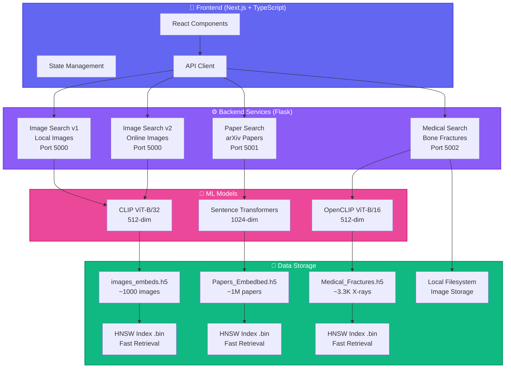

<div align="center">

# 🔍 HNSW Semantic Search Engine


<p align="center">
  <strong>A powerful multi-modal semantic search engine for images, papers, and medical diagnostics</strong>
</p>

<p align="center">
  
  
  
  
  
</p>

<p align="center">
  
  
  
</p>

---

### 🎯 **[Documentation](./) | [API Docs](./backend/README.md)**

</div>

---

## ✨ Features

<table>
<tr>
<td width="33%">

### 🖼️ Image Search
- 🔍 **Natural Language Search**
  Search images using plain English
- 🖼️ **Image-to-Image Search**
  Upload an image, find similar ones
- 🤖 **CLIP Embeddings**
  State-of-the-art vision-language AI
- 🌐 **Multi-Source Support**
  1000+ images from Flickr, Pinterest, Google
- ⚡ **Lightning Fast**
  HNSW algorithm for instant results

</td>
<td width="33%">

### 📚 Paper Search
- 📄 **Semantic Paper Search**
  Search 1M+ arXiv papers semantically
- 📝 **Document Upload**
  Upload PDF/TXT to find similar papers
- 🔬 **High-Quality Embeddings**
  Sentence Transformers (RoBERTa-large)
- 🎓 **Comprehensive Coverage**
  Full arXiv metadata indexed
- 🚀 **Fast Retrieval**
  Sub-second search across millions

</td>
<td width="33%">

### 🏥 Medical Search (NEW)
- 🦴 **Bone Fracture Search**
  Search X-ray images by medical terms
- 🧠 **OpenCLIP Model**
  ViT-B-16 pretrained on massive datasets
- 🏥 **Local Secure Storage**
  Privacy-first local image serving
- 📊 **Clinical Accuracy**
  Finds similar fracture patterns instantly
- ⚡ **Efficient Indexing**
  ~19MB storage for 3,300+ X-rays

</td>
</tr>
</table>

<div align="center">

### 🎨 **Modern UI** • 🌓 **Dark Mode** • 📱 **Responsive Design** • 📊 **Similarity Scores** • 💾 **Smart Caching**

</div>

---

## 🏗️ Architecture



---

## 🚀 Quick Start

<details open>
<summary><b>📦 Installation</b></summary>

### 1️⃣ Clone the Repository

```bash
git clone https://github.com/dsa-advanced-assignment-hnsw/hnsw-search-engine.git
cd hnsw-search-engine
```

### 2️⃣ Setup Backend (Conda Recommended)

```bash
cd backend

# Create environment
conda env create -f environment.yml

# Activate
conda activate hnsw-backend-venv

# Install additional dependencies (if needed)
pip install -r requirements-clean.txt
```

### 3️⃣ Choose Your Server

```bash
# 🖼️ Image Search v2 (Online Images)
python server_v2.py  # Port 5000

# 📄 Paper Search (arXiv Papers)
python server_paper.py  # Port 5001

# 🏥 Medical Search (Bone Fractures)
python server_medical.py  # Port 5002
```

### 4️⃣ Setup Frontend

```bash
cd client

# Install dependencies
npm install

# Configure API URLs
echo "NEXT_PUBLIC_API_URL=http://localhost:5000" > .env.local
echo "NEXT_PUBLIC_PAPER_API_URL=http://localhost:5001" >> .env.local
echo "NEXT_PUBLIC_MEDICAL_API_URL=http://localhost:5002" >> .env.local

# Start dev server
npm run dev
```

### 5️⃣ Open Browser

🎉 Visit **http://localhost:3000** and start searching!

</details>

---

## 🛠️ Technology Stack

<div align="center">

### Backend Technologies

<p>
  
  
  
  
  
  
</p>

### Frontend Technologies

<p>
  
  
  
  
</p>

### ML Models

<table align="center">
<tr>
<td align="center" width="33%">
  <br />
  <b>CLIP / OpenCLIP</b><br />
  <sub>Vision-Language Models</sub><br />
  <code>512-dim embeddings</code>
</td>
<td align="center" width="33%">
  <br />
  <b>Sentence Transformers</b><br />
  <sub>all-roberta-large-v1</sub><br />
  <code>1024-dim embeddings</code>
</td>
<td align="center" width="33%">
  <br />
  <b>HNSW Algorithm</b><br />
  <sub>Vector Similarity Search</sub><br />
  <code>Sub-second retrieval</code>
</td>
</tr>
</table>

</div>

---

## 📊 API Endpoints

<details>
<summary><b>🏥 Medical Search API (Port 5002)</b></summary>

### Search by Text
```bash
POST /search
Content-Type: application/json

{
  "query": "distal radius fracture",
  "k": 20
}
```

### Search by X-ray Image
```bash
POST /search/image
Content-Type: multipart/form-data

FormData:
  - image: [file]
  - k: 20
```

### Serve Image
```bash
GET /image?path=/absolute/path/to/image.jpg
```
</details>

<details>
<summary><b>🖼️ Image Search API (Port 5000)</b></summary>

### Search by Text
```bash
POST /search
Content-Type: application/json

{
  "query": "sunset over mountains",
  "k": 20
}
```

### Search by Image
```bash
POST /search/image
Content-Type: multipart/form-data

FormData:
  - image: [file]
  - k: 20
```
</details>

<details>
<summary><b>📄 Paper Search API (Port 5001)</b></summary>

### Search by Text
```bash
POST /search
Content-Type: application/json

{
  "query": "transformer neural networks",
  "k": 20
}
```
</details>

---

## 📁 Project Structure

```
dsa-advanced-assignment-hnsw/
│
├── 🎨 client/                           # Next.js Frontend
│   ├── src/app/
│   │   ├── page.tsx                     # Main search interface (All tabs)
│   │   └── layout.tsx                   # App layout
│   ├── .env.local                       # API URL Configuration
│   └── README.md
│
├── ⚙️ backend/                          # Flask Backend Services
│   ├── server.py                        # Image search v1 (local)
│   ├── server_v2.py                     # Image search v2 (online)
│   ├── server_paper.py                  # Paper search (Port 5001)
│   ├── server_medical.py                # Medical search (Port 5002) ⭐
│   │
│   ├── 📦 Data Files
│   │   ├── images_embeds_new.h5         # Image embeddings
│   │   ├── Papers_Embedbed_*.h5         # Paper embeddings
│   │   └── Medical_Fractures_Embedbed.h5 # Medical embeddings
│   │
│   └── 📄 Configuration
│       ├── requirements-clean.txt       # Backend dependencies
│       └── environment.yml              # Conda environment
│
├── 🏥 medical_embedder/                 # Medical Embedding Pipeline
│   ├── generate_embeddings_local.py     # Embedding generator
│   ├── bone_fractures/                  # Local image dataset
│   └── README.md
│
├── 🔬 paper_embedder/                   # Paper Embedding Pipeline
├── 🖼️ image_embedder/                   # Image Embedding Pipeline
│
└── 📚 Documentation
    ├── README.md                        # This file
    └── CLAUDE.md                        # Development guide
```

---

## 📈 Performance

<div align="center">

| Metric | Image Search | Paper Search | Medical Search |
|--------|--------------|--------------|----------------|
| **Index Size** | 1,000 images | 1M papers | ~3,400 X-rays |
| **Query Time** | < 100ms | < 200ms | < 50ms |
| **Embedding** | 512-dim | 1024-dim | 512-dim |
| **Storage** | ~5MB | ~4GB | ~19MB |
| **Accuracy** | High | High | Clinical |

</div>

---

## 📄 License

<div align="center">

**MIT License**

Copyright (c) 2025 HNSW Search Engine

</div>

---

<div align="center">

### 💖 Built with love using

**CLIP • OpenCLIP • HNSW • Flask • Next.js**

</div>
