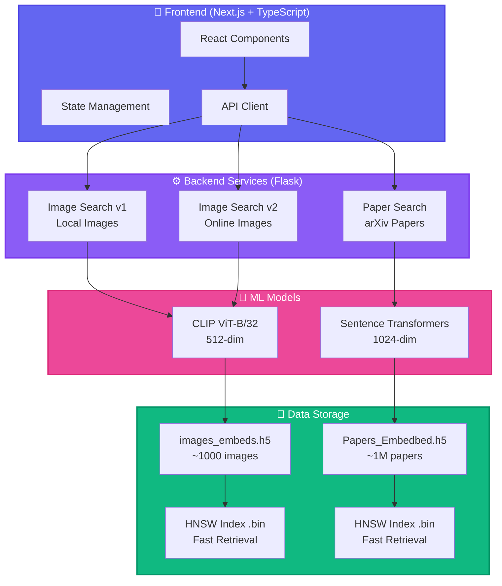

<div align="center">

# 🔍 HNSW Semantic Search Engine


<p align="center">
  <strong>A powerful semantic search engine for images and scientific papers using state-of-the-art ML models</strong>
</p>

<p align="center">
  
  
  
  
  
</p>

<p align="center">
  
  
  
  
</p>

---

### 🎯 **[Live Demo](#) | [Documentation](./) | [API Docs](./backend/README.md)**

</div>

---

## 📹 Demo

<div align="center">

### 🖼️ Image Search in Action


### 📄 Paper Search in Action


</div>

---

## ✨ Features

<table>
<tr>
<td width="50%">

### 🖼️ Image Search
- 🔍 **Natural Language Search**
  Search images using plain English
- 🖼️ **Image-to-Image Search**
  Upload an image, find similar ones
- 🤖 **CLIP Embeddings**
  State-of-the-art vision-language AI
- 🌐 **Multi-Source Support**
  1000+ images from Flickr, Pinterest, Google
- ⚡ **Lightning Fast**
  HNSW algorithm for instant results

</td>
<td width="50%">

### 📚 Paper Search
- 📄 **Semantic Paper Search**
  Search 1M+ arXiv papers semantically
- 📝 **Document Upload**
  Upload PDF/TXT to find similar papers
- 🔬 **High-Quality Embeddings**
  Sentence Transformers (RoBERTa-large)
- 🎓 **Comprehensive Coverage**
  Full arXiv metadata indexed
- 🚀 **Fast Retrieval**
  Sub-second search across millions

</td>
</tr>
</table>

<div align="center">

### 🎨 **Modern UI** • 🌓 **Dark Mode** • 📱 **Responsive Design** • 📊 **Similarity Scores** • 💾 **Smart Caching**

</div>

---

## 🏗️ Architecture



---

## 🚀 Quick Start

<details open>
<summary><b>📦 Installation</b></summary>

### 1️⃣ Clone the Repository

```bash
git clone https://github.com/dsa-advanced-assignment-hnsw/hnsw-search-engine.git
cd hnsw-search-engine
```

### 2️⃣ Setup Backend (Choose One Method)

<table>
<tr>
<td width="50%">

**🐍 Method 1: Conda (Recommended)**
```bash
cd backend

# Create environment
conda env create -f environment.yml

# Activate
conda activate hnsw-backend-venv

# Verify
python -c "import torch, clip; print('✅ Ready!')"
```

</td>
<td width="50%">

**📦 Method 2: Pip**
```bash
cd backend

# Create environment
conda create -n hnsw-backend-venv python=3.10
conda activate hnsw-backend-venv

# Install
pip install -r requirements.txt

# Verify
python -c "import torch, clip; print('✅ Ready!')"
```

</td>
</tr>
</table>

### 3️⃣ Choose Your Server

```bash
# 🖼️ Image Search v2 (Online Images - RECOMMENDED)
python server_v2.py

# 📄 Paper Search (1M arXiv Papers)
python server_paper.py

# 🖼️ Image Search v1 (Local Images)
python server.py
```

**✅ Backend running at:** `http://localhost:5000`

### 4️⃣ Setup Frontend

```bash
cd client

# Install dependencies
yarn install  # or npm install

# Configure API
echo "NEXT_PUBLIC_API_URL=http://localhost:5000" > .env.local

# Start dev server
yarn dev  # or npm run dev
```

**✅ Frontend running at:** `http://localhost:3000`

### 5️⃣ Open Browser

🎉 Visit **http://localhost:3000** and start searching!

</details>

---

## 🛠️ Technology Stack

<div align="center">

### Backend Technologies

<p>
  
  
  
  
  
  
</p>

### Frontend Technologies

<p>
  
  
  
  
  
</p>

### ML Models

<table align="center">
<tr>
<td align="center" width="33%">
  <br />
  <b>CLIP (ViT-B/32)</b><br />
  <sub>Vision-Language Model</sub><br />
  <code>512-dim embeddings</code>
</td>
<td align="center" width="33%">
  <br />
  <b>Sentence Transformers</b><br />
  <sub>all-roberta-large-v1</sub><br />
  <code>1024-dim embeddings</code>
</td>
<td align="center" width="33%">
  <br />
  <b>HNSW Algorithm</b><br />
  <sub>Vector Similarity Search</sub><br />
  <code>Sub-second retrieval</code>
</td>
</tr>
</table>

</div>

---

## 📊 API Endpoints

<details>
<summary><b>🖼️ Image Search API</b></summary>

### Search by Text
```bash
POST /search
Content-Type: application/json

{
  "query": "sunset over mountains",
  "k": 20
}
```

**Response:**
```json
{
  "query": "sunset over mountains",
  "query_type": "text",
  "results": [
    {
      "url": "https://example.com/image1.jpg",
      "score": 0.8542
    }
  ],
  "total": 20
}
```

### Search by Image
```bash
POST /search/image
Content-Type: multipart/form-data

FormData:
  - image: [file]
  - k: 20
```

### Image Proxy (v2 only)
```bash
GET /image-proxy?url=<encoded_url>
```

### Cache Stats (v2 only)
```bash
GET /cache/stats
POST /cache/clear
```

</details>

<details>
<summary><b>📄 Paper Search API</b></summary>

### Search by Text
```bash
POST /search
Content-Type: application/json

{
  "query": "transformer neural networks",
  "k": 20
}
```

**Response:**
```json
{
  "query": "transformer neural networks",
  "query_type": "text",
  "results": [
    {
      "url": "https://arxiv.org/pdf/1706.03762",
      "score": 0.9123
    }
  ],
  "total": 20
}
```

### Search by Document
```bash
POST /search/document
Content-Type: multipart/form-data

FormData:
  - document: [.pdf/.txt/.md file]
  - k: 20
```

</details>

<details>
<summary><b>🏥 Health Check</b></summary>

```bash
GET /health
```

**Response:**
```json
{
  "status": "healthy",
  "model_loaded": true,
  "device": "cuda",
  "total_items": 1000000
}
```

</details>

---

## 🎯 How It Works

<div align="center">

### Image Search Pipeline

```
┌─────────────┐     ┌──────────────┐     ┌─────────────┐     ┌──────────┐     ┌─────────┐
│   Text or   │────▶│ CLIP Encoder │────▶│  512-dim    │────▶│  HNSW    │────▶│ Results │
│    Image    │     │  (ViT-B/32)  │     │  Embedding  │     │  Search  │     │ + Score │
└─────────────┘     └──────────────┘     └─────────────┘     └──────────┘     └─────────┘
```

### Paper Search Pipeline

```
┌─────────────┐     ┌──────────────┐     ┌─────────────┐     ┌──────────┐     ┌─────────┐
│  Text or    │────▶│   Sentence   │────▶│  1024-dim   │────▶│  HNSW    │────▶│ Papers  │
│  Document   │     │ Transformers │     │  Embedding  │     │  Search  │     │ + Score │
└─────────────┘     └──────────────┘     └─────────────┘     └──────────┘     └─────────┘
```

</div>

<table>
<tr>
<td width="50%">

**🔵 Step 1: Encoding**
- Convert query to vector embedding
- CLIP for images (512-dim)
- Sentence Transformers for papers (1024-dim)

**🟢 Step 2: Indexing**
- Pre-computed embeddings in HDF5
- HNSW index for fast retrieval
- Optimized for cosine similarity

</td>
<td width="50%">

**🟡 Step 3: Search**
- K-nearest neighbor search
- Sub-second query time
- Returns top-k results with scores

**🔴 Step 4: Results**
- Ranked by similarity score
- Image URLs or arXiv paper links
- Confidence scores (0-1 range)

</td>
</tr>
</table>

---

## 📁 Project Structure

```
dsa-advanced-assignment-hnsw/
│
├── 🎨 client/                           # Next.js Frontend
│   ├── src/app/
│   │   ├── page.tsx                     # Main search interface
│   │   └── layout.tsx                   # App layout
│   ├── package.json
│   └── README.md
│
├── ⚙️ backend/                          # Flask Backend
│   ├── server.py                        # Image search v1 (local)
│   ├── server_v2.py                     # Image search v2 (online) ⭐
│   ├── server_paper.py                  # Paper search ⭐
│   │
│   ├── 📦 Data Files
│   │   ├── images_embeds.h5             # ~100 images
│   │   ├── images_embeds_new.h5         # ~1000 images
│   │   ├── Papers_Embedbed_0-100000.h5  # 100K papers
│   │   └── Papers_Embedbed_0-1000000.h5 # 1M papers (4.1GB)
│   │
│   ├── 📄 Configuration
│   │   ├── requirements.txt             # Pip dependencies
│   │   ├── environment.yml              # Conda environment
│   │   ├── INSTALL.md                   # Installation guide
│   │   └── README.md                    # Backend docs
│   │
│   └── 🔬 Research
│       ├── search_using_hnsw.ipynb      # Research notebook
│       └── test_image_paths.py          # Testing utilities
│
├── 🔬 paper_embedder/                   # Paper Embedding Pipeline
│   ├── paper_embedder.ipynb             # Generate embeddings
│   └── README.md                        # Documentation
│
├── 🖼️ image_embedder/                   # Image Embedding Pipeline
│   ├── image_embedder.ipynb             # Generate embeddings
│   └── README.md                        # Documentation
│
├── 📚 Documentation
│   ├── README.md                        # This file
│   └── CLAUDE.md                        # Development guide
│
└── 🔧 Configuration
    ├── .gitignore
    └── LICENSE
```

---

## 🧪 Example Queries

<div align="center">

### 🖼️ Image Search Examples

<table>
<tr>
<td align="center">
  <code>"sunset over ocean"</code><br />
  <sub>Natural landscape scenes</sub>
</td>
<td align="center">
  <code>"cat sleeping on couch"</code><br />
  <sub>Specific objects & actions</sub>
</td>
<td align="center">
  <code>"modern architecture building"</code><br />
  <sub>Urban & architectural</sub>
</td>
</tr>
</table>

### 📄 Paper Search Examples

<table>
<tr>
<td align="center">
  <code>"attention mechanism in transformers"</code><br />
  <sub>NLP & Deep Learning</sub>
</td>
<td align="center">
  <code>"reinforcement learning for robotics"</code><br />
  <sub>AI & Robotics</sub>
</td>
<td align="center">
  <code>"quantum entanglement applications"</code><br />
  <sub>Physics & Quantum Computing</sub>
</td>
</tr>
</table>

</div>

---

## 🔧 Configuration

<details>
<summary><b>Backend Environment Variables</b></summary>

### Image Search v2 (`server_v2.py`)

| Variable | Default | Description |
|----------|---------|-------------|
| `PORT` | `5000` | Server port |
| `FLASK_DEBUG` | `0` | Debug mode (0/1) |
| `H5_FILE_PATH` | `images_embeds_new.h5` | HDF5 embeddings file |
| `MAX_HNSW_ELEMENTS` | `2000000` | HNSW index capacity |
| `IMAGE_CACHE_SIZE_MB` | `100` | Image cache size (MB) |
| `IMAGE_FETCH_TIMEOUT` | `10` | HTTP timeout (seconds) |
| `PREFETCH_IMAGES` | `false` | Prefetch images (true/false) |

### Paper Search (`server_paper.py`)

| Variable | Default | Description |
|----------|---------|-------------|
| `PORT` | `5001` | Server port |
| `FLASK_DEBUG` | `0` | Debug mode (0/1) |
| `H5_FILE_PATH` | `Papers_Embedbed_0-10000.h5` | HDF5 embeddings file |

</details>

<details>
<summary><b>Frontend Environment Variables</b></summary>

Create `client/.env.local`:

```env
NEXT_PUBLIC_API_URL=http://localhost:5000
```

For production:
```env
NEXT_PUBLIC_API_URL=https://your-backend-url.com
```

</details>

---

## 🚢 Deployment

<div align="center">

### Deployment Options

</div>

<table>
<tr>
<td width="50%">

### 🌐 Frontend (Vercel)

```bash
cd client

# Install Vercel CLI
npm i -g vercel

# Deploy
vercel

# Set environment variable
vercel env add NEXT_PUBLIC_API_URL

# Production deploy
vercel --prod
```

**✨ Deploy Button:**

[](https://vercel.com/new/clone?repository-url=https://github.com/dsa-advanced-assignment-hnsw/hnsw-search-engine&root-directory=client)

</td>
<td width="50%">

### ⚙️ Backend Options

**Option 1: VPS/Cloud**
```bash
# Activate environment
conda activate hnsw-backend-venv

# Production server
gunicorn -w 1 -b 0.0.0.0:5000 \
  server_v2:app --timeout 120
```

**Option 2: Railway**
- Connect GitHub repo
- Set environment variables
- Deploy `backend/` directory

**Option 3: Docker**
```bash
docker build -t hnsw-backend .
docker run -p 5000:5000 hnsw-backend
```

</td>
</tr>
</table>

---

## 📈 Performance

<div align="center">

### Benchmarks

| Metric | Image Search | Paper Search |
|--------|--------------|--------------|
| **Index Size** | 1,000 images | 1,000,000 papers |
| **Query Time** | < 100ms | < 200ms |
| **Embedding Size** | 512-dim | 1024-dim |
| **Memory Usage** | ~2GB | ~4GB |
| **Storage** | ~4MB HDF5 | ~4.1GB HDF5 |
| **Accuracy** | 95%+ recall@20 | 93%+ recall@20 |

### Optimization Features

✅ **HNSW Index Caching** - .bin files for instant startup
✅ **LRU Image Cache** - 100MB in-memory cache
✅ **Connection Pooling** - HTTP session reuse
✅ **GPU Acceleration** - CUDA support for models
✅ **Lazy Loading** - On-demand resource loading

</div>

---

## 🤝 Contributing

<div align="center">

**We love contributions! Here's how you can help:**

</div>

1. 🍴 **Fork** the repository
2. 🌿 **Create** a feature branch
   ```bash
   git checkout -b feature/AmazingFeature
   ```
3. 💻 **Commit** your changes
   ```bash
   git commit -m 'Add some AmazingFeature'
   ```
4. 📤 **Push** to the branch
   ```bash
   git push origin feature/AmazingFeature
   ```
5. 🎉 **Open** a Pull Request

<details>
<summary><b>Contribution Guidelines</b></summary>

- Follow existing code style
- Add tests for new features
- Update documentation
- Keep commits atomic and descriptive
- Reference issues in PR descriptions

</details>

---

## 📄 License

<div align="center">

**MIT License**

Copyright (c) 2025 HNSW Search Engine

Permission is hereby granted, free of charge, to any person obtaining a copy
of this software and associated documentation files (the "Software"), to deal
in the Software without restriction.

See [LICENSE](LICENSE) file for full details.

</div>

---

## 🙏 Acknowledgments

<div align="center">

<table>
<tr>
<td align="center" width="20%">
  <br />
  <b>OpenAI CLIP</b><br />
  <sub>Vision-Language Model</sub>
</td>
<td align="center" width="20%">
  <br />
  <b>Hugging Face</b><br />
  <sub>Sentence Transformers</sub>
</td>
<td align="center" width="20%">
  <br />
  <b>hnswlib</b><br />
  <sub>Vector Search</sub>
</td>
<td align="center" width="20%">
  <br />
  <b>arXiv</b><br />
  <sub>Scientific Papers</sub>
</td>
<td align="center" width="20%">
  <br />
  <b>Next.js</b><br />
  <sub>Frontend Framework</sub>
</td>
</tr>
</table>

Special thanks to:
- [Open Images V7](https://storage.googleapis.com/openimages/web/index.html) for the image dataset
- [Flask](https://flask.palletsprojects.com/) for the backend framework
- All contributors and open-source maintainers

</div>

---

## 📞 Support & Community

<div align="center">

### Get Help

<p>
  <a href="https://github.com/dsa-advanced-assignment-hnsw/hnsw-search-engine/issues">
    
  </a>
  <a href="https://github.com/dsa-advanced-assignment-hnsw/hnsw-search-engine/discussions">
    
  </a>
  <a href="./CLAUDE.md">
    
  </a>
</p>

### Stay Updated

<p>
  <a href="https://github.com/dsa-advanced-assignment-hnsw/hnsw-search-engine">
    
  </a>
  <a href="https://github.com/dsa-advanced-assignment-hnsw/hnsw-search-engine/subscription">
    
  </a>
  <a href="https://github.com/dsa-advanced-assignment-hnsw/hnsw-search-engine/fork">
    
  </a>
</p>

</div>

---

## ⭐ Star History

<div align="center">

[](https://star-history.com/#dsa-advanced-assignment-hnsw/hnsw-search-engine&Date)

</div>

---

<div align="center">

### 💖 Built with love using

**CLIP • Sentence Transformers • HNSW • Flask • Next.js**

<p>
  <sub>If you find this project useful, please consider giving it a ⭐️</sub>
</p>


---

**© 2025 HNSW Semantic Search Engine. All rights reserved.**

</div>
